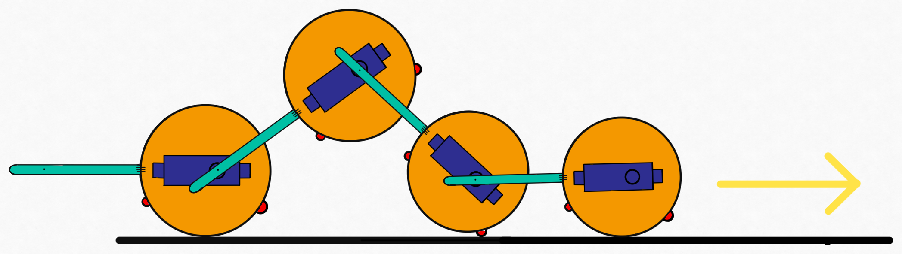

# Mecatronica-Proyecto

Nuestro proyeccto consiste en un robot articulado con forma de gusano. Este robot se mueve de forma análoga a este tipo de animales, usando un conjunto de servo-motores sincronizados.

